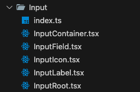
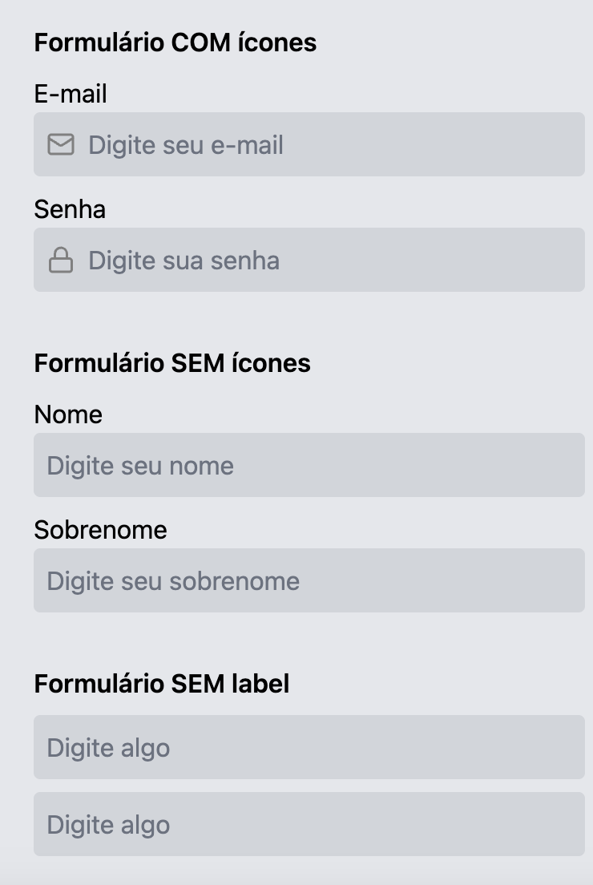

# Criando componentes utilizando Composição

## 📕 Índice

- [Anotação](#-anotacao)
- [Tecnologias utilizadas](#-tecnologias-utilizadas)
- [Como baixar o projeto](#-como-baixar-o-projeto)

---

## ℹ️ Anotação

Essa estrutura de componentes permite criar e editar facilmente componentes complexos evitando o uso de props.

A principal vantagem é a flexibilidade e a manutenção do componente, que passam a ser formados por partes menores e que vão permitindo a customização de variações.

Abaixo segue exemplo de sugestão para o componente <strong>Input</strong>:



### Explicação detalhada:

- Podemos criar uma pasta para centralizar os arquivos que compoem o componente, nesse exemplo se chama Input e dentro dela criamos o arquivo index que centraliza as partes menores que poderão formar um Input:

```ts
import { InputContainer } from "./InputContainer";
import { InputField } from "./InputField";
import { InputIcon } from "./InputIcon";
import { InputLabel } from "./InputLabel";
import { InputIRoot } from "./InputRoot";

export const Input = {
  Root: InputIRoot,
  Container: InputContainer,
  Field: InputField,
  Icon: InputIcon,
  Label: InputLabel,
};
```

- O arquivo Root funciona como um container para os demais componentes, então ele recebe o children:

```ts
import { ReactNode } from "react";

type InputRootProps = {
  children: ReactNode;
};

export function InputIRoot({ children }: InputRootProps) {
  return <div className="flex flex-col">{children}</div>;
}
```

- Os demais arquivos são formados por pequenos "blocos" que podemos adicionar para compor o componente principal. No caso do input poderia ser: ícone, label, mensagem de erro etc, abaixo segue exemplo com a label:

```ts
type InputLabelProps = {
  text: string;
};
export function InputLabel({ text }: InputLabelProps) {
  return <label>{text}</label>;
}
```

### Exemplo das possíveis customizações:



```ts
  <div className="flex flex-col gap-2 w-1/4">
    <h2 className="font-semibold">Input COM label e ícone</h2>
    <Input.Root>
      <Input.Label text="E-mail" />
      <Input.Container>
        <Input.Icon icon={MailIcon} />
        <Input.Field placeholder="Digite seu e-mail" />
      </Input.Container>
    </Input.Root>
  </div>

  <div className="flex flex-col gap-2 w-1/4">
    <h2 className="font-semibold">Input SEM ícone</h2>
    <Input.Root>
      <Input.Label text="Nome" />
      <Input.Container>
        <Input.Field placeholder="Digite seu nome" />
      </Input.Container>
    </Input.Root>
  </div>

  <div className="flex flex-col gap-2 w-1/4">
    <h2 className="font-semibold">Input SEM label</h2>
    <Input.Root>
      <Input.Container>
        <Input.Field placeholder="Digite algo" />
      </Input.Container>
    </Input.Root>
  </div>
```

---

## 💻 Tecnologias utilizadas

O projeto foi feito utilizando as seguintes tecnologias

- React
- Typescript
- Vite
- Tailwind CSS

---

## 📦 Como baixar o projeto

```bash
  #clonar o repositorio
  $ git clone https://github.com/milenahikari/composition-components.git

  #entrar na pasta do projeto
  $ cd composition-components

  #instalar as dependencias
  $ npm i

  #executar o projeto
  $ npm run dev
```

Desenvolvido com ♥ por Milena Hikari
